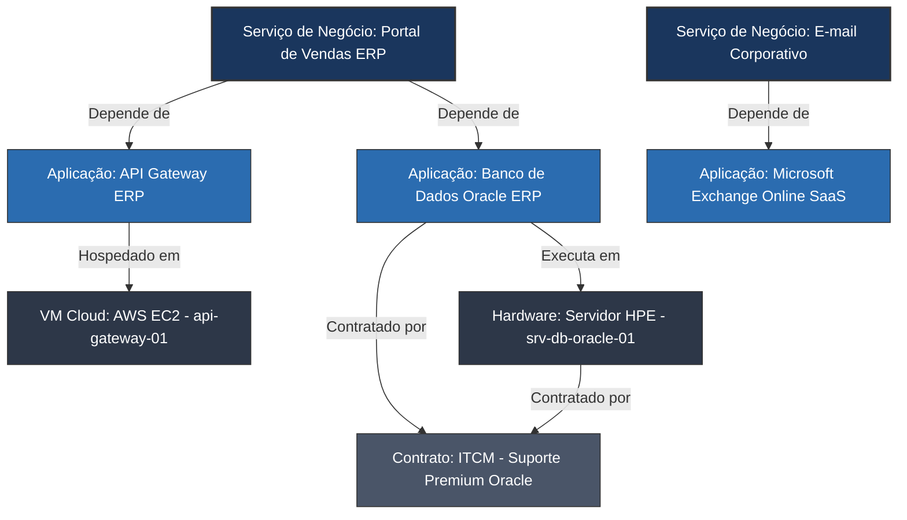

# REVISÃO E DIRETRIZES DE IMPLEMENTAÇÃO: ITAM & CMDB NO TOPdesk
*Documento de Análise Crítica e Recomendações Estratégicas*

---

## 1. Introdução e Visão Geral

Esta revisão técnica foi elaborada com o objetivo de analisar a proposta de implementação da Gestão de Ativos de TI (ITAM) e Gerenciamento de Configuração (CMDB) detalhada no [itam.md](file:///home/andre/GitHub/itam/itam.md), focando na integração dessas práticas dentro da plataforma **TOPdesk** (onde o Gerenciamento de Incidentes já está operacional).

O TOPdesk possui uma arquitetura baseada em **Cartões de Ativos Flexíveis (Asset Management)** que substituiu o antigo modelo rígido de CMDB. Essa flexibilidade permite que uma única base de dados armazene tanto informações financeiras/patrimoniais (ITAM) quanto informações operacionais/de relacionamento (CMDB). 

Abaixo, apresentamos as análises críticas, correções técnicas necessárias e novas sugestões de alto valor para garantir o sucesso do projeto de implantação.

---

## 2. Análise Crítica e Correções Técnicas ao Documento Original

### 2.1 Ajuste Fino de Escopo no Pilar de Cloud & FinOps (Seção 5.3)
> [!WARNING]
> **Correção Conceitual Importante:** O documento original propõe registrar métricas de telemetria fina em tempo real no TOPdesk (como *horas de processamento, consumo de CPU/Memória, IOPS, tráfego de dados (egress) e volume de tokens consumidos de IA*).

* **O Problema:** O TOPdesk é uma ferramenta de ITSM e ITAM, não uma plataforma de monitoramento de infraestrutura (APM) ou ferramenta de faturamento (Billing Cloud). Tentar sincronizar e registrar dados voláteis de telemetria fina diretamente nos Cartões de Ativos do TOPdesk causará severa degradação de performance no banco de dados, poluição visual da interface para os analistas, atrasos em APIs e problemas crônicos de obsolescência dos dados.
* **A Solução Recomendada:**
  1. O TOPdesk deve registrar apenas a **governança e metadados estruturais** do ativo em nuvem (ex: ID do Recurso, Provedor AWS/Azure/GCP, Tipo de Instância, Centro de Custo, Status Operacional, Dono do Recurso, Data de Criação, Ambiente [Prod/Homol/Dev] e links para os painéis nativos de monitoramento ou FinOps).
  2. O monitoramento de consumo de CPU/Memória e a gestão orçamentária (alertas preventivos de 80% e 90%) devem residir nas ferramentas de origem (AWS Budgets, Azure Cost Management, Vantage, etc.).
  3. **Integração de Alerta Crítico:** Se uma ferramenta de nuvem detectar estouro de orçamento ou anomalia (*spend spike*), ela deve enviar um Webhook para o TOPdesk que abrirá automaticamente um **Incidente** ou registrará um alerta no respectivo Cartão do Serviço, acionando o fluxo de gerenciamento de incidentes nativo.

### 2.2 Unificação Prática de ITAM e CMDB no TOPdesk (Seção 7.1)
Embora a divisão teórica entre ITAM e CMDB seja fundamental para fins acadêmicos e de auditoria, na prática do TOPdesk, ambos os mundos se consolidam no mesmo **Cartão de Ativo** através do uso estratégico de **Abas** e **Permissões de Acesso**:
* **Aba Operacional/CMDB:** Visível para a equipe de Suporte e Infraestrutura (dados de rede, IP, SO, versão, relacionamentos de topologia).
* **Aba Financeira/ITAM:** Visível apenas para Compras, Patrimônio e Governança de TI (dados de Nota Fiscal, valor de aquisição, depreciação acumulada, contrato de manutenção e link do fornecedor).
* Isso evita a duplicidade de cadastros e garante que o analista de Service Desk veja o ativo técnico enquanto o comprador vê o ativo financeiro sob o mesmo identificador único.

---

## 3. Novas Sugestões e Recomendações Estratégicas

### 3.1 Integração Nativa com o Fluxo de Incidentes (Melhoria do Service Desk)
Aproveitando que o Gerenciamento de Incidentes já está implementado no TOPdesk, a CMDB deve ser usada para empoderar os técnicos de atendimento:
* **Vinculação Obrigatória:** Configurar os formulários de Incidentes (tanto no Portal de Autoatendimento - SSP quanto no console do operador) para exigir a vinculação do Ativo/CI afetado.
* **Histórico de Incidentes por Ativo:** O TOPdesk consolidará no Cartão de cada Ativo todos os chamados abertos contra ele. Isso permite identificar equipamentos com comportamento de "limão" (equipamentos que falham constantemente) para acelerar a tomada de decisão sobre a substituição precoce (fase de *Hardware Refresh*).
* **Base de Conhecimento:** Integrar o campo de Ativo/CI ao Gerenciamento de Conhecimento. Se o usuário abrir um chamado sobre a "VPN Corporativa", o sistema deve sugerir automaticamente os tutoriais associados àquele CI de rede.

### 3.2 Automações via Sequências de Ações (Action Sequences)
Para garantir a integridade dos dados sem depender exclusivamente de processos manuais (Raciocínio de Governança), propõe-se a automação do ciclo de vida dos ativos usando as **Action Sequences (APIs internas do TOPdesk)**:
1. **Transição "Em Preparação" ➔ "Em Uso":** Quando um chamado de "Entrega de Equipamento" for fechado, uma Action Sequence atualiza o status do ativo no Asset Management para "Em Uso" e atribui o Usuário Responsável de acordo com o solicitante do chamado.
2. **Transição "Em Uso" ➔ "Manutenção":** A abertura de um chamado de conserto de hardware altera o status do ativo para "Em Manutenção" e registra o número do chamado no histórico do ativo.
3. **Bloqueio Automático de Endpoints Órfãos:** Caso um ativo do tipo *Endpoint* perca o vínculo com o usuário (ex: funcionário desligado) por mais de 15 dias, uma Action Sequence pode disparar um alerta para o Active Directory/Entra ID desativar a máquina na rede por conformidade de segurança.

### 3.3 Termo de Responsabilidade 100% Digital no Portal de Autoatendimento (SSP)
> [!TIP]
> **Redução de Custo e Papel:** Substituir assinaturas físicas ou plataformas externas de assinatura digital para a entrega de endpoints (como notebooks e celulares) por um fluxo nativo do TOPdesk.

* **Fluxo Proposto:**
  1. A TI prepara o notebook do usuário e altera o status para "Disponível para Entrega".
  2. O TOPdesk cria uma tarefa de **Aprovação / Confirmação** no Portal de Autoatendimento (SSP) do colaborador destinatário.
  3. O colaborador retira o notebook física ou remotamente. Ao ligar a máquina, ele acessa o TOPdesk (SSP), lê as diretrizes de uso corporativo e clica em **"Confirmar Recebimento e Aceitar Termos de Uso"**.
  4. O aceite eletrônico grava no log histórico do Cartão do Ativo a data, hora, IP, e-mail do aprovador e gera um log auditável para fins de auditoria interna e compliance legal.

### 3.4 Regras de Conciliação de Dados (Reconciliation Rules)
Ao integrar ferramentas de varredura automática (Microsoft Intune, Lansweeper, SCCM) com o TOPdesk via API de Ativos, é imperativo definir a **propriedade dos dados** para evitar conflitos de sincronização:

| Tipo do Dado | Origem / Proprietário | Ação na Divergência |
| --- | --- | --- |
| **Especificações Técnicas** (RAM, CPU, Disco, IP, MAC, Softwares instalados) | **Ferramenta de Discovery** (Intune/Lansweeper) | O TOPdesk é atualizado automaticamente a cada sincronização diária. |
| **Informações de Negócio** (Centro de Custo, Status Operacional, Criticidade, Dono) | **TI / Compras (Manual/Workflow)** | Bloqueado para atualização via API de Discovery. Apenas fluxos de negócio TOPdesk ou alteração manual direta alteram esses campos. |
| **Informações Cadastrais de Usuários** (Lotação, Departamento, E-mail) | **Diretório de Identidades** (Entra ID / AD) | Sincronização automática diária com a tabela de Pessoas do TOPdesk. |

### 3.5 Adequação à LGPD (Lei Geral de Proteção de Dados)
Como os Cartões de Ativos de Hardware registram a custódia física de dispositivos, dados de usuários (Nome, E-mail, Matrícula) estarão atrelados aos registros.
* **Diretriz de Retenção:** O histórico de quem utilizou o equipamento deve ser mantido por motivos de auditoria de segurança da informação (ex: rastrear quem cometeu uma infração na rede interna em determinada data).
* **Acesso Restrito:** As abas que listam o histórico de usuários passados do ativo devem ter visibilidade restrita apenas aos perfis de "Administrador de ITAM" e "Segurança da Informação", ocultando esses dados para analistas do Service Desk comum.
* **Anonimização no Descarte:** No momento em que o ativo for para descarte físico e baixa contábil definitiva, o processo de desvinculação deve permitir arquivar o cartão removendo a visualização direta de dados pessoais, mantendo apenas logs agregados.

---

## 4. Estratégia de Modelagem de Relacionamentos (CMDB)

Para manter a CMDB limpa, intuitiva e operacional no TOPdesk, recomenda-se estabelecer uma estrutura de relacionamentos baseada em 3 níveis (Serviço de Negócio ➔ Aplicação/Componente Lógico ➔ Infraestrutura Física/Nuvem).

### Exemplo de Estrutura de Modelagem no TOPdesk

> [!IMPORTANT]
> **Regra de Ouro para CMDB no TOPdesk:** Evite mapear "tudo o que se conecta a tudo". CIs de baixo valor (ex: mouses, teclados, cabos, switches de borda não gerenciados) não devem fazer parte da árvore de relacionamentos para não gerar ruído no mapa de impacto operacional.

---

## 5. Cronograma Recomendado de Implementação (Faseamento)

A implementação concomitante de ITAM e CMDB pode ser complexa. Propõe-se um cronograma de 4 fases para viabilizar as entregas de forma ágil:

### Fase 1: Fundação & HAM (Meses 1-2)
* Configuração dos templates flexíveis de hardware (User Endpoints e Periféricos) no TOPdesk.
* Importação e saneamento dos inventários manuais (planilhas) e estabelecimento do processo de etiqueta patrimonial física em conjunto com a Controladoria.
* Parametrização do fluxo de entrega de equipamentos e ativação do **Termo de Responsabilidade Digital no SSP**.
* Integração com o Active Directory/Entra ID para sincronização de Pessoas.

### Fase 2: Automatização de Inventário & SAM (Meses 3-4)
* Integração via API de Ativos com ferramentas de MDM/Discovery (ex: Microsoft Intune para endpoints de usuários).
* Ativação dos primeiros relatórios automáticos de conformidade de hardware.
* Criação de templates de Software (SAM) no TOPdesk e mapeamento das licenças vigentes contra contratos ativos (ITCM).

### Fase 3: Governança de Contratos & CMDB de Infraestrutura (Meses 5-6)
* Cadastro completo de Contratos de TI (ITCM) no TOPdesk com configuração do motor de alertas de vencimento (120, 90, 60, 30 dias).
* Mapeamento de CIs de Data Center e Nuvem (Servidores, storages, bancos de dados lógicos).
* Desenho gráfico dos primeiros 10 Serviços de Negócio críticos na CMDB do TOPdesk.
* Integração operacional de Incidentes com a CMDB.

### Fase 4: Integração de Mudanças, FinOps e Otimização (Meses 7+)
* Vinculação obrigatória da CMDB ao módulo de Gerenciamento de Mudanças (RFC).
* Integração de alertas de estouro de custos em Nuvem via Webhooks (FinOps básico no TOPdesk).
* Auditoria do nível de maturidade e ajustes finos nos processos com base nos KPIs obtidos.

---

## 6. Dicionário de Dados Expandido (Sugestão para Configuração de Templates)

Propõe-se a criação dos seguintes campos adicionais para viabilizar as sugestões acima no módulo de *Asset Management* do TOPdesk:

| Nome do Campo (Interface) | Tipo de Campo | Pilar | Objetivo Prático / Regra de Negócio |
| --- | --- | --- | --- |
| **Ambiente** | Dropdown | CMDB | Valores: `Produção`, `Homologação`, `Desenvolvimento`, `Testes`. Ajuda a filtrar CIs críticos em caso de incidentes. |
| **Tipo de Licença** | Dropdown | SAM | Valores: `Mensal (SaaS)`, `Anual (SaaS)`, `Perpétua (On-Premise)`. Utilizado no cálculo de custo recorrente de softwares. |
| **Responsável Técnico (Grupo)** | Link Interno | CMDB | Link com a tabela de Grupos do Service Desk (ex: Equipe DBAs, Equipe Redes). Facilita o roteamento de incidentes do CI. |
| **Certificado de Sanitização** | Upload de Arquivo | HAM | PDF contendo o laudo técnico de apagamento lógico de dados da máquina antes do descarte (Requisito ISO 27001). |
| **ID da Conta Cloud / Assinatura** | Texto Curto | Cloud | Identificador da assinatura AWS/Azure onde o recurso reside. Permite o rastreamento financeiro correto. |
| **Link FinOps / Monitoramento** | URL | Cloud | Link direto para o painel do recurso no console Cloud ou ferramenta APM externa para agilizar o diagnóstico técnico. |
| **Status do Termo de Responsabilidade** | Dropdown | HAM | Valores: `Aguardando Aceite no SSP`, `Aceito Digitalmente`, `Não Aplicável`. Monitoramento do compliance de entrega do ativo. |
| **Data do Aceite do Termo** | Data/Hora | HAM | Preenchido automaticamente via Action Sequence quando o usuário aprova o termo no portal SSP. |
